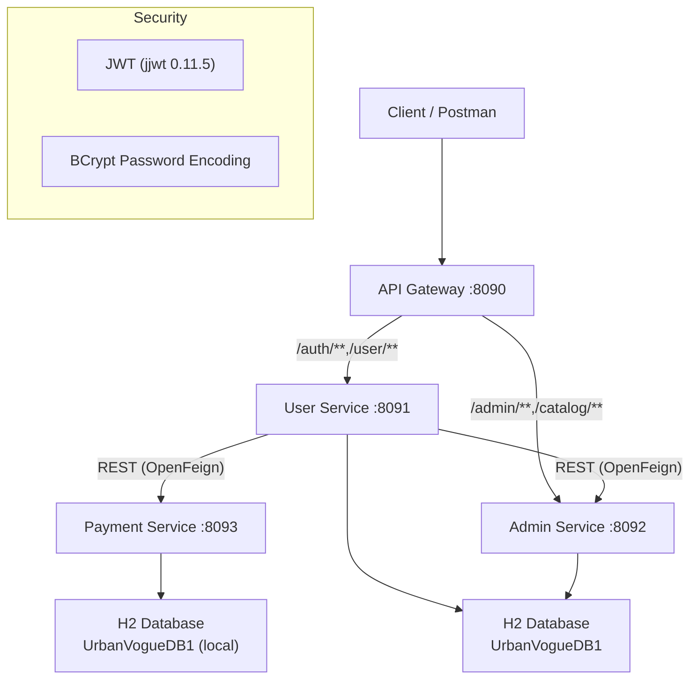
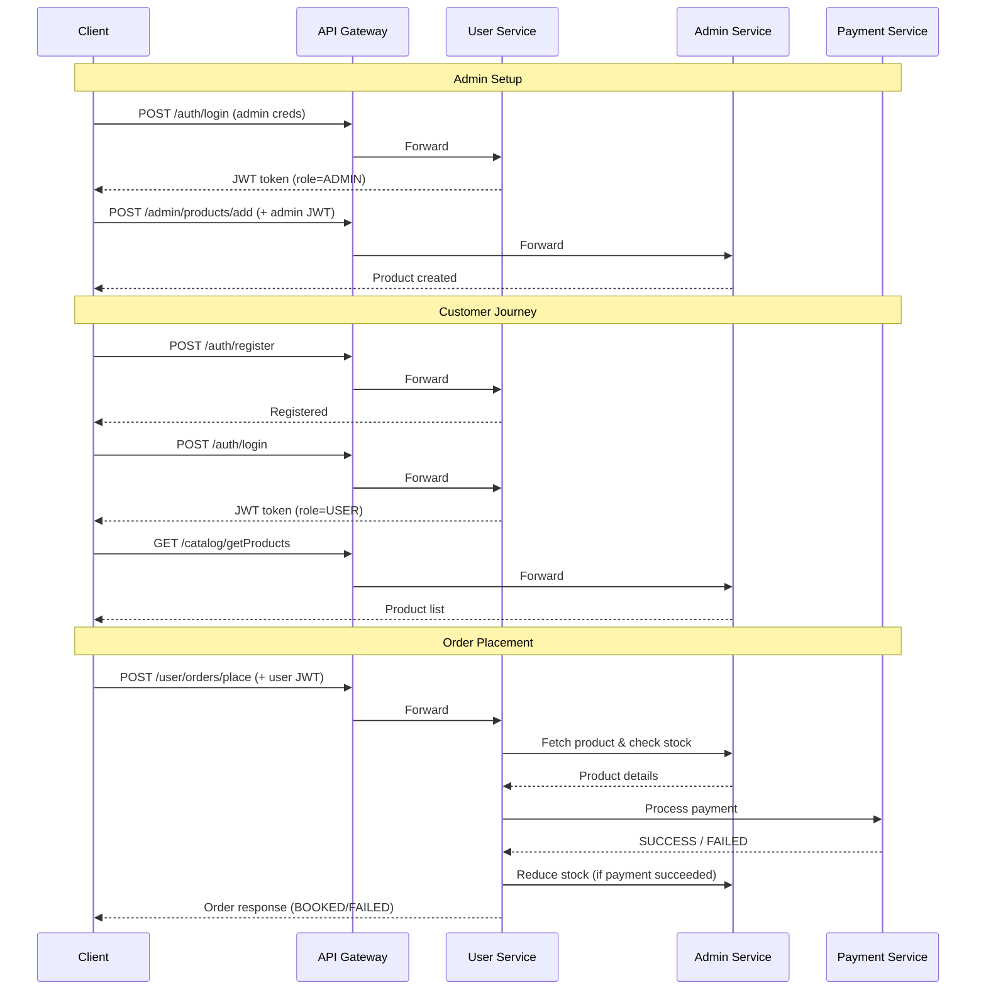

# UVA-main (UrbanVogue Apparel) — Comprehensive Project Summary

## Overview

**UVA-main** is a microservices-based e-commerce backend for **UrbanVogue Apparel**, a fashion/apparel brand. Built with **Java 21** and **Spring Boot**, the project follows a clean microservice architecture with 4 independently deployable services that communicate via REST APIs.

---

## Architecture Diagram

---

## Technology Stack

| Layer | Technology |
|---|---|
| Language | Java 21 |
| Framework | Spring Boot 4.0.3 (services), 3.3.5 (gateway) |
| Cloud | Spring Cloud 2025.1.0 / 2023.0.3 |
| API Gateway | Spring Cloud Gateway |
| Inter-service Communication | Spring Cloud OpenFeign + RestTemplate |
| Security | Spring Security + JWT (jjwt 0.11.5) |
| Database | H2 (file-based, shared across services) |
| ORM | Spring Data JPA / Hibernate |
| Utilities | Lombok, Spring Boot DevTools |
| Build | Maven |

---

## Microservices Breakdown

### 1. API Gateway (`:8090`)
**Path:** [api-gateway](file:///Users/akashnandan/Documents/Programming/UVA-main/api-gateway)

**Purpose:** Single entry point for all client requests. Handles routing and JWT-based authentication filtering.

**Key Components:**
- [AuthFilter.java](file:///Users/akashnandan/Documents/Programming/UVA-main/api-gateway/src/main/java/com/UrbanVogue/gateway/filter/AuthFilter.java) — `GlobalFilter` that validates JWT tokens on every request. Public paths (`/auth/**`, `/user/getProducts`, `/catalog/**`) skip authentication.
- [SecurityConfig.java](file:///Users/akashnandan/Documents/Programming/UVA-main/api-gateway/src/main/java/com/UrbanVogue/gateway/security/SecurityConfig.java) — Reactive security config: CSRF disabled, CORS enabled, currently permits all exchanges.
- [JwtUtil.java](file:///Users/akashnandan/Documents/Programming/UVA-main/api-gateway/src/main/java/com/UrbanVogue/gateway/security/JwtUtil.java) — JWT utility for token validation, email/role extraction.
- [CorsConfig.java](file:///Users/akashnandan/Documents/Programming/UVA-main/api-gateway/src/main/java/com/UrbanVogue/gateway/config/CorsConfig.java) — CORS configuration.

**Route Mapping:**

| Route Pattern | Target Service |
|---|---|
| `/auth/**` | user-service (`:8091`) |
| `/user/**` | user-service (`:8091`) |
| `/admin/**` | admin-service (`:8092`) |
| `/catalog/**` | admin-service (`:8092`) |

---

### 2. User Service (`:8091`)
**Path:** [user-service](file:///Users/akashnandan/Documents/Programming/UVA-main/user-service)

**Purpose:** Handles user authentication, order placement, and product browsing from the customer perspective.

**Modules:**

#### AuthModule (9 files)
- [AuthController.java](file:///Users/akashnandan/Documents/Programming/UVA-main/user-service/src/main/java/com/UrbanVogue/user/AuthModule/controller/AuthController.java) — `POST /auth/register`, `POST /auth/login`
- [AuthService.java](file:///Users/akashnandan/Documents/Programming/UVA-main/user-service/src/main/java/com/UrbanVogue/user/AuthModule/service/AuthService.java) — Registration with duplicate email check, BCrypt password hashing, JWT token generation on login
- [AdminInitializer.java](file:///Users/akashnandan/Documents/Programming/UVA-main/user-service/src/main/java/com/UrbanVogue/user/AuthModule/service/AdminInitializer.java) — Seeds a default admin user on startup
- [User.java](file:///Users/akashnandan/Documents/Programming/UVA-main/user-service/src/main/java/com/UrbanVogue/user/AuthModule/entity/User.java) — Entity with fields: `id`, `name`, `email` (unique), `password`, `phoneNumber`, `address`, `role`

#### OrderModule (12 files)
- [OrderController.java](file:///Users/akashnandan/Documents/Programming/UVA-main/user-service/src/main/java/com/UrbanVogue/user/OrderModule/controller/OrderController.java) — `POST /user/orders/place` (authenticated)
- [OrderService.java](file:///Users/akashnandan/Documents/Programming/UVA-main/user-service/src/main/java/com/UrbanVogue/user/OrderModule/service/OrderService.java) — Core order flow:
  1. Extract customer email from JWT
  2. Fetch product from admin-service via `ProductClient`
  3. Check stock availability
  4. Calculate total amount
  5. Call payment-service via `PaymentClient`
  6. On SUCCESS → reduce stock + save order as BOOKED
  7. On FAILURE → save order as FAILED
- [Order.java](file:///Users/akashnandan/Documents/Programming/UVA-main/user-service/src/main/java/com/UrbanVogue/user/OrderModule/entity/Order.java) — Entity: `id`, `productId`, `productName`, `customerEmail`, `quantity`, `price`, `totalAmount`, `address`, `paymentStatus`, `orderStatus`, `createdAt`
- [ProductClient.java](file:///Users/akashnandan/Documents/Programming/UVA-main/user-service/src/main/java/com/UrbanVogue/user/OrderModule/client/ProductClient.java) — Feign client to admin-service for product data & stock reduction
- [PaymentClient.java](file:///Users/akashnandan/Documents/Programming/UVA-main/user-service/src/main/java/com/UrbanVogue/user/OrderModule/client/PaymentClient.java) — Feign client to payment-service

#### ProductModule (3 files)
- [GetProductController.java](file:///Users/akashnandan/Documents/Programming/UVA-main/user-service/src/main/java/com/UrbanVogue/user/ProductModule/controller/GetProductController.java) — `GET /user/getProducts` (public, for catalog browsing)

#### Security (3 files)
- [JwtAuthFilter.java](file:///Users/akashnandan/Documents/Programming/UVA-main/user-service/src/main/java/com/UrbanVogue/user/filter/JwtAuthFilter.java), [JwtUtil.java](file:///Users/akashnandan/Documents/Programming/UVA-main/user-service/src/main/java/com/UrbanVogue/user/security/JwtUtil.java), [SecurityConfig.java](file:///Users/akashnandan/Documents/Programming/UVA-main/user-service/src/main/java/com/UrbanVogue/user/security/SecurityConfig.java)

---

### 3. Admin Service (`:8092`)
**Path:** [admin-service](file:///Users/akashnandan/Documents/Programming/UVA-main/admin-service)

**Purpose:** Product management (CRUD), inventory control, catalog serving, and internal order-handling APIs.

**Modules:**

#### addProduct (5 files)
- [ProductController.java](file:///Users/akashnandan/Documents/Programming/UVA-main/admin-service/src/main/java/com/UrbanVogue/admin/addProduct/controller/ProductController.java) — `POST /admin/products/add` (admin-only)
- [Product.java](file:///Users/akashnandan/Documents/Programming/UVA-main/admin-service/src/main/java/com/UrbanVogue/admin/addProduct/entity/Product.java) — Entity: `id`, `name`, `brand`, `category`, `size`, `color`, `price`, `imageUrl`, `description`, `numberOfPieces`, `createdAt`

#### Inventory (3 files)
- [InventoryController.java](file:///Users/akashnandan/Documents/Programming/UVA-main/admin-service/src/main/java/com/UrbanVogue/admin/Inventory/controller/InventoryController.java) — `PUT /admin/inventory/{id}?numberOfPieces=N`, `GET /admin/inventory/products`

#### UpdateDetails (3 files)
- [UpdateProductController.java](file:///Users/akashnandan/Documents/Programming/UVA-main/admin-service/src/main/java/com/UrbanVogue/admin/UpdateDetails/controller/UpdateProductController.java) — Product update endpoints

#### catalog (3 files)
- [CatalogController.java](file:///Users/akashnandan/Documents/Programming/UVA-main/admin-service/src/main/java/com/UrbanVogue/admin/catalog/controller/CatalogController.java) — `GET /catalog/getProducts` (public), `GET /catalog/getProducts/{id}`

#### orderHandling (3 files)
- [InternalController.java](file:///Users/akashnandan/Documents/Programming/UVA-main/admin-service/src/main/java/com/UrbanVogue/admin/orderHandling/controller/InternalController.java) — Internal APIs called by user-service for product fetching and stock reduction during order placement

#### Security (2 files)
- [JwtAuthFilter.java](file:///Users/akashnandan/Documents/Programming/UVA-main/admin-service/src/main/java/com/UrbanVogue/admin/filter/JwtAuthFilter.java), [SecurityConfig.java](file:///Users/akashnandan/Documents/Programming/UVA-main/admin-service/src/main/java/com/UrbanVogue/admin/security/SecurityConfig.java)

---

### 4. Payment Service (`:8093`)
**Path:** [payment-service](file:///Users/akashnandan/Documents/Programming/UVA-main/payment-service)

**Purpose:** Simulates payment processing. Currently uses a **randomized mock** (70% success, 30% failure).

**Key Files (4 total):**
- [PaymentController.java](file:///Users/akashnandan/Documents/Programming/UVA-main/payment-service/src/main/java/com/UrbanVogue/payment/controller/PaymentController.java) — `POST /payment/process`
- [PaymentService.java](file:///Users/akashnandan/Documents/Programming/UVA-main/payment-service/src/main/java/com/UrbanVogue/payment/service/PaymentService.java) — Random-based payment simulation
- [PaymentRequestDTO.java](file:///Users/akashnandan/Documents/Programming/UVA-main/payment-service/src/main/java/com/UrbanVogue/payment/dto/PaymentRequestDTO.java) — Input: `orderId`, `amount`
- [PaymentResponseDTO.java](file:///Users/akashnandan/Documents/Programming/UVA-main/payment-service/src/main/java/com/UrbanVogue/payment/dto/PaymentResponseDTO.java) — Output: `status` (SUCCESS / FAILED)

> [!NOTE]
> The payment service is **not** routed through the API gateway. It is called directly by user-service via OpenFeign on `:8093`.

---

## Database Design

All services share a single **H2 file-based database** (`UrbanVogueDB1`) with `AUTO_SERVER=TRUE` mode for concurrent access.

### Tables

| Table | Service | Key Columns |
|---|---|---|
| `users` | user-service | id, name, email, password (BCrypt), phoneNumber, address, role |
| `product` | admin-service | id, name, brand, category, size, color, price, imageUrl, description, numberOfPieces, createdAt |
| `orders` | user-service | id, productId, productName, customerEmail, quantity, price, totalAmount, address, paymentStatus, orderStatus, createdAt |

---

## Authentication & Security

- **JWT-based auth** with shared secret key across all services
- JWT tokens encode **email** and **role** (USER / ADMIN)
- Token expiration: **72 hours** (259,200,000 ms)
- Password hashing: **BCrypt**
- Admin user is **auto-seeded** at startup via `AdminInitializer`
- Public endpoints: `/auth/**`, `/user/getProducts`, `/catalog/**`
- Protected endpoints: `/user/orders/**`, `/admin/**`

---

## End-to-End User Flow

---

## Project Statistics

| Metric | Value |
|---|---|
| Total Java files | 49 |
| Microservices | 4 |
| JPA Entities | 3 (User, Product, Order) |
| REST Endpoints | ~15+ |
| Config files | 5 (4 [.properties](file:///Users/akashnandan/Documents/Programming/UVA-main/api-gateway/target/classes/application.properties) + 1 [.yml](file:///Users/akashnandan/Documents/Programming/UVA-main/api-gateway/target/classes/application.yml)) |
| Build system | Maven (per-service [pom.xml](file:///Users/akashnandan/Documents/Programming/UVA-main/api-gateway/pom.xml), no parent POM) |

---

## Notable Observations

> [!IMPORTANT]
> **No parent POM** — Each service has its own independent [pom.xml](file:///Users/akashnandan/Documents/Programming/UVA-main/api-gateway/pom.xml). There is no multi-module Maven setup.

> [!WARNING]
> **Spring Boot version mismatch** — The API Gateway uses Spring Boot **3.3.5** while all other services use **4.0.3**. This is intentional because Spring Cloud Gateway requires the reactive (WebFlux) stack.

> [!NOTE]
> - **Payment is mocked** — Uses `Random` with 70% success rate, no real payment gateway integration yet.
> - **H2 database** is suitable for development only; production would require MySQL/PostgreSQL.
> - The gateway [SecurityConfig](file:///Users/akashnandan/Documents/Programming/UVA-main/api-gateway/src/main/java/com/UrbanVogue/gateway/security/SecurityConfig.java#9-32) currently has `anyExchange().permitAll()` — JWT enforcement happens in the [AuthFilter](file:///Users/akashnandan/Documents/Programming/UVA-main/api-gateway/src/main/java/com/UrbanVogue/gateway/filter/AuthFilter.java#19-98) instead of Spring Security rules.
> - Some debug `System.out.println` statements remain in [AuthFilter.java](file:///Users/akashnandan/Documents/Programming/UVA-main/api-gateway/src/main/java/com/UrbanVogue/gateway/filter/AuthFilter.java).
> - Spring Security in user-service is commented out in one place and re-added later in the POM, suggesting iterative development.
